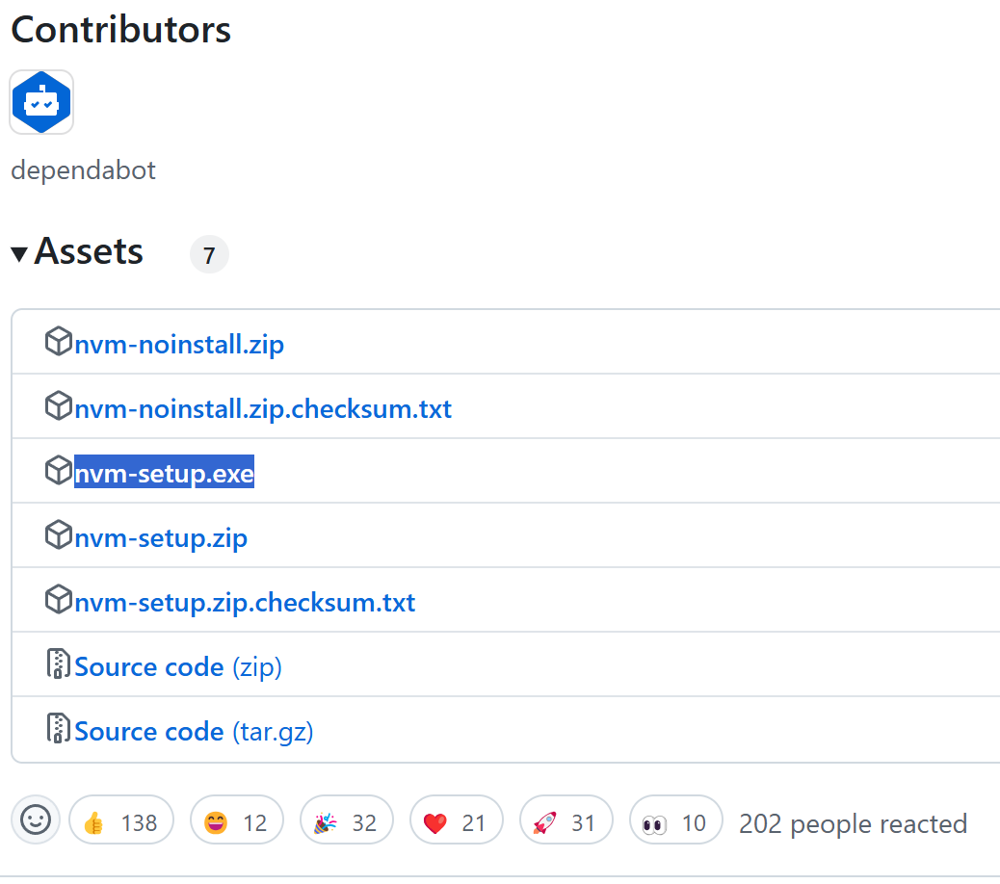
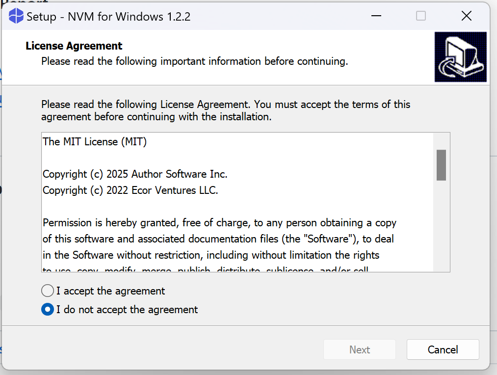

nvm（Node Version Manager）是一个用于管理 Node.js 版本的工具，以下是关于它的详细介绍：
- 版本管理：允许用户在同一台机器上轻松安装、切换和管理多个不同版本的 Node.js。例如，在开发不同项目时，可能需要使用不同版本的 Node.js 来满足项目的特定需求，nvm 可以方便地进行版本切换，而无需重新安装系统或担心版本冲突问题。
- 环境隔离：为每个项目创建独立的 Node.js 运行环境，确保项目之间的依赖和配置相互隔离，避免相互干扰。这有助于提高开发的稳定性和可维护性，特别是在处理多个具有不同依赖要求的项目时。
- 简单易用：提供了简洁的命令行接口，用户可以通过简单的命令完成各种操作，如安装特定版本的 Node.js、查看已安装的版本、切换当前使用的版本等。
### 一、安装
1. 下载安装包地址：
[Releases · coreybutler/nvm-windows · GitHub](https://github.com/coreybutler/nvm-windows/releases)
::: center

::: 

2. win安装路径： `C:\Users\13613\AppData\Roaming\nvm`
::: center

::: 
### 二、常用命令
```js
// 1、查看已经安装的node版本
nvm ls
 
// 2、查看可以安装的node版本
nvm ls available
 
// 3、安装指定版本
nvm install 版本号
 
// 4、切换到指定版本
nvm use 版本号
 
// 5、显示当前版本
nvm current
 
// 6、给不同的版本添加别名
nvm alias
 
// 7、删除已定义的别名
nvm unalias
 
// 8、在当前环境下， 重新全局安装指定版本号的npm包
nvm reinstall-packages
 
// 9、打开nodejs控制
nvm on
 
// 10、关闭nodejs控制
nvm off
 
// 11、查看设置代理
nvm proxy
 
// 12、卸载指定版本
nvm uninstall 版本号
 
// 13、设置和查看root路径
nvm root [path]
 
// 14、查看nvm版本
nvm version
```